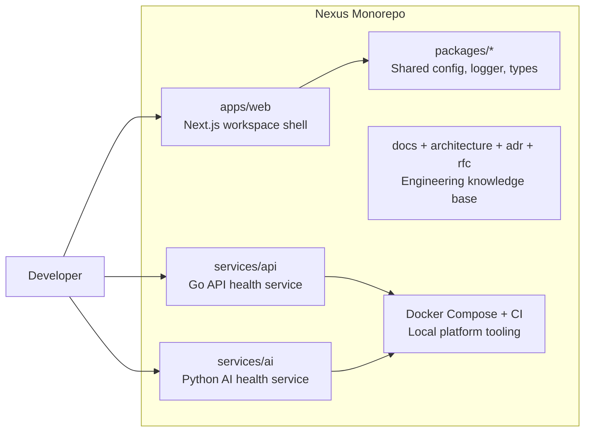
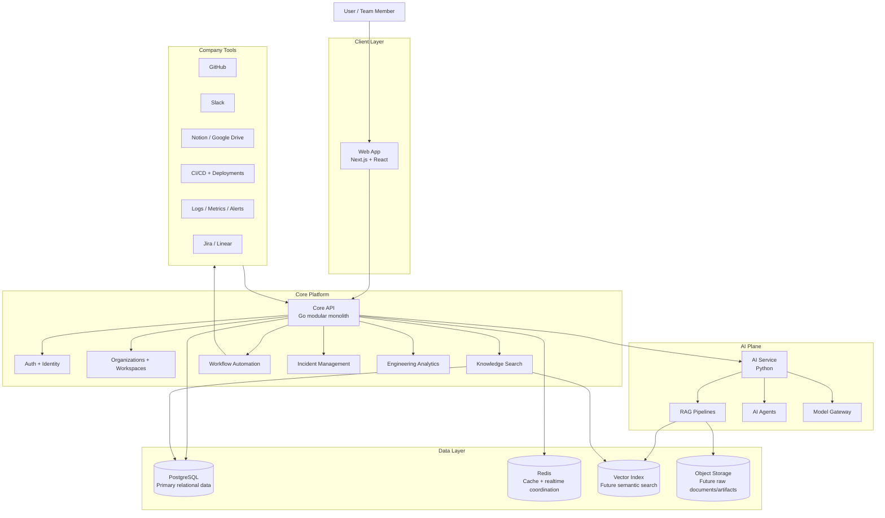
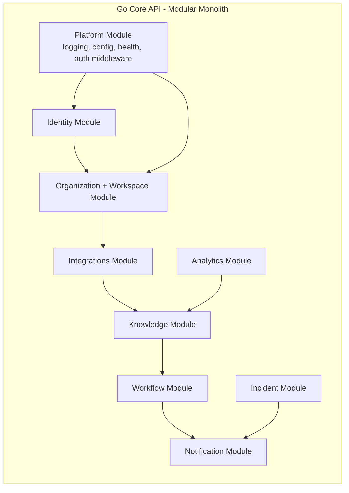
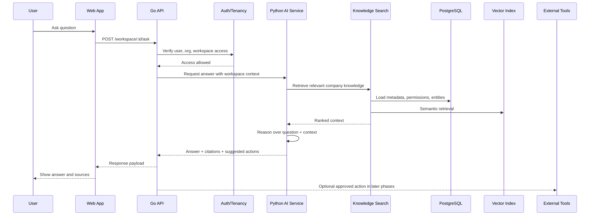
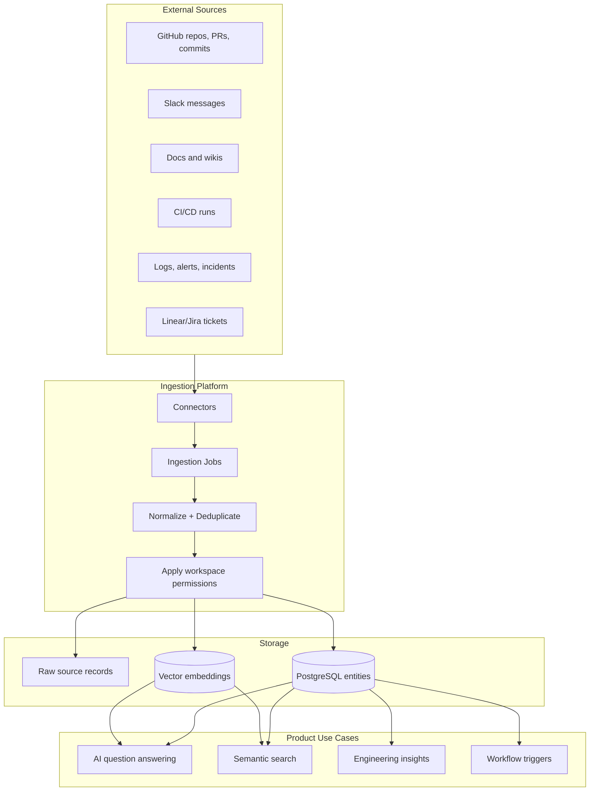
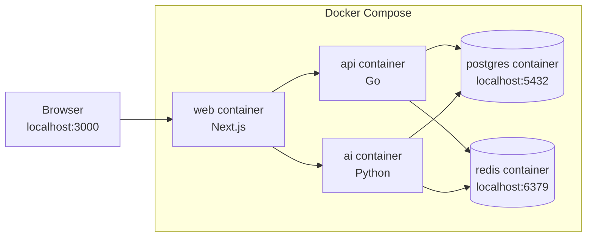
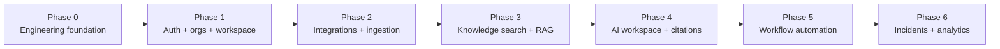

# Nexus System Design

This document explains what Nexus is, which pieces exist today, which pieces are planned, and how they relate.

Nexus is an AI-native operational intelligence platform. The long-term product connects company tools such as GitHub, Slack, docs, CI/CD, logs, and project management systems into one AI workspace where teams can ask questions, investigate failures, automate workflows, and understand engineering operations.

## Current Foundation

The repository currently contains the engineering foundation, not the full product.



Today, the system proves that the platform can run locally with separate web, API, AI, PostgreSQL, and Redis containers. Product features such as login, organizations, chat, search, integrations, and automations are intentionally not built yet.

## Runtime Architecture

This is the intended high-level runtime shape as product features are added.



## Main Product Concept

Nexus becomes the operational layer above a company’s fragmented tools.

Instead of manually checking GitHub, Slack, docs, CI/CD, logs, deployments, and tickets, a user asks Nexus a question or creates an automation. Nexus retrieves the right context, reasons over it, and either answers the user or triggers an approved workflow.

Examples:

- “Why did deployment fail yesterday?”
- “How does authentication work?”
- “Create an incident room and draft an RCA when production deployment fails.”
- “Show engineering bottlenecks and sprint risks for this week.”

## Core Modules

Nexus starts as a modular monolith. That means the backend is one deployable Go API at first, but internally it is separated into clear product modules.



### Why modular monolith first?

- Easier local development.
- Easier debugging.
- Lower operational complexity.
- Cleaner module boundaries before extracting services.
- Better fit for an early-stage platform.

Microservices can come later only after module boundaries are stable and real scale requires extraction.

## How A User Question Will Work

The most important user flow is asking Nexus a question about the company.



Key rule: AI should not blindly act. For risky operations such as rollback, ticket creation, or incident escalation, Nexus should require explicit permissions, audit logs, and approval flows.

## How Company Data Will Enter Nexus

Nexus needs reliable ingestion before it can answer useful questions.



## Local Development Topology

This is what `docker compose up --build` runs locally.



Current health endpoints:

- Web: `http://localhost:3000`
- API: `http://localhost:8080/healthz`
- AI: `http://localhost:8090/healthz`

## Repository Map

```text
apps/web
  User interface and workspace experience.

services/api
  Core backend API. Starts as a Go modular monolith.

services/ai
  Python AI plane for future RAG, agents, embeddings, and model orchestration.

packages/config
  Shared TypeScript config helpers.

packages/logger
  Shared TypeScript structured logging helper.

packages/types
  Shared TypeScript contracts.

infra/docker
  Dockerfiles for local service builds.

docs, architecture, adr, rfc
  Engineering knowledge base and decision history.
```

## Build Phases



### Phase 0: Foundation

Already started.

- Monorepo setup.
- Web/API/AI service stubs.
- Docker Compose.
- CI workflow.
- Engineering docs.

### Phase 1: Auth, Organizations, Workspace

The first real product slice.

- Users can sign in.
- Users belong to organizations.
- Organizations contain workspaces.
- API has real persistence in PostgreSQL.
- Web app has basic workspace navigation.

Implementation notes for this slice live in `docs/auth-workspace-slice.md`.

### Phase 2: Integrations and Ingestion

- Connect GitHub first.
- Store repos, commits, pull requests, and metadata.
- Add ingestion jobs and sync status.

### Phase 3: Knowledge Search and RAG

- Convert indexed company data into searchable knowledge.
- Add embeddings and semantic retrieval.
- Return answers with sources.

### Phase 4: AI Workspace

- User-facing chat/workspace experience.
- Conversation history.
- Citations.
- Workspace-aware answers.

### Phase 5: Workflow Automation

- Trigger-based automations.
- Approval gates.
- Audit logs.
- Notifications.

### Phase 6: Incidents and Analytics

- Incident timelines.
- Deployment failure analysis.
- Engineering bottleneck dashboards.

## Key Design Rules

- Build vertical slices, not isolated layers.
- Keep the Go API modular before considering microservices.
- Keep the Python AI service focused on AI orchestration, retrieval, and model workflows.
- Store source-of-truth business data in PostgreSQL first.
- Use Redis for cache, coordination, and future realtime support.
- Add vector search only when ingestion and knowledge models exist.
- Require permissions, audit logs, and approval flows before AI performs external actions.
